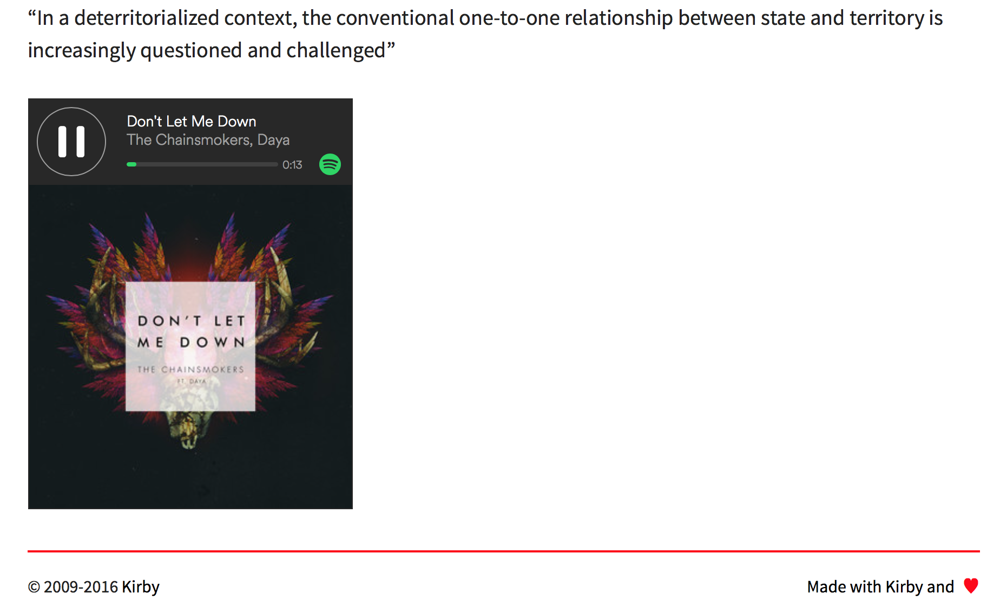

  

[](https://github.com/distantnative/oembed/releases) 
[](https://github.com/distantnative/oembed/issues) 
[](https://gumroad.com/l/kirby-oembed)

The oEmbed plugin extends [Kirby CMS](http://getkirby.com) with some extensive embed functionalities. It enables Kirby to display embeds of several media sites (e.g. YouTube, Vimeo, Soundcloud, Instagram etc.) by only providing the URL to the medium.

It is built on the [oscarotero/Embed](https://github.com/oscarotero/Embed) library.


## Table of Contents
1. [Requirements](#Requirements)
2. [Installation & Update](#Installation)
3. [Usage](#Usage)
4. [Options](#Options)
5. [Styles & Scripts](#StylesScripts)
5. [Examples](#Usage)
6. [Help & Improve](#Help)
7. [Version History](#VersionHistory)

## Requirements <a id="Requirements"></a>
Kirby CMS 2.3.0+ and PHP 5.4+.


## Installation & Update <a id="Installation"></a>
1. Download [oEmbed](https://github.com/distantnative/oembed/zipball/master/) and add the files to `site/plugins/oembed/` 
2. Add the necessary styles by including the following in the header:
```php
<?= css('assets/plugins/oembed/css/oembed.css') ?>
```

#### With video lazyload [option](#Options)
3. Add the necessary script by including the following right before the `</body>` tag:
```php
<?= js('assets/plugins/oembed/js/oembed.js') ?>
```

#### With the [Kirby CLI](https://github.com/getkirby/cli)
```
kirby plugin:install distantnative/oembed
```


## Usage <a id="Usage"></a>
**As field method in templates:**  
Use the method on fields that contain a url that points to a supported medium (e.g. YouTube, Vimeo, Twitter, Instagram, Spotify etc.):
```php
<?= $page->featured_tweet()->oembed(); ?>
```


**As Kirbytext tag:**  
```
You'll be given love. You'll be taken care of. You'll be given love. You have to trust it. Maybe not from the sources. You have poured yours. Maybe not from the directions. You are staring at.

(oembed: https://vimeo.com/43444347)

Twist your head around. It's all around you. All is full of love. All around you. All is full of love. You just ain't receiving. All is full of love. Your phone is off the hook. All is full of love. Your doors are all shut. All is full of love.
```

**As global PHP helper function:**
```php
<?= oembed('https://www.youtube.com/watch?v=m2ua3O_fdCY') ?>
```

## Options <a id="Options"></a>

#### Per embed
You can set the following options on each embed to apply:

```php
// with the field method
<?= $page->featured_video()->oemebed([
  'lazyvideo' => true
]) ?>

// with the Kirbytext tag
(oembed: https://www.youtube.com/watch?v=IlV7RhT6zHs lazyvideo: true)
```

| Option      | Values         | Description                               |
|-------------|----------------|-------------------------------------------|
| `class`     | (string)       | Class to be added to the embed wrapper    |
| `thumb`     | (string)       | Custom thumbnail (URL)                    |
| `autoload`  | `true`/`false` | Starts the embedded video automatically   |
| `lazyvideo` | `true`/`false` | Lazyload the embedded video               |
| `jsapi`     | `true`/`false` | Activates the JS API of certain providers |


#### Global
You can set the following options in your `site/config/config.php` to generally apply to all embeds:

```php
c::set('plugin.oembed.video.autoplay', false);

c::set('plugin.oembed.video.lazyload', true);
c::set('plugin.oembed.video.lazyload.btn', 'assets/plugins/oembed/images/play.png');

c::set('plugin.oembed.caching', true);
c::set('plugin.oembed.caching.duration', 24); // in hours

c::set('plugin.oembed.providers.jsapi', false);
```

## Styles & Scripts <a id="StylesScripts"></a>
The oEmbed plugin comes with very minimal styles, mainly for embedded videos and only a small script necessary when lazyloading videos:

```php
// Include styles
<?= css('assets/plugins/oembed/css/oembed.css') ?>

// Include script
<?= js('assets/plugins/oembed/js/oembed.js') ?>
```

If you want to further customize and work with the embedded media. The following CSS classes are applied to the main wrapper:
```
.kirby-plugin-oembed
.kirby-plugin-oembed--{TYPE}      // e.g. video, rich
.kirby-plugin-oembed--{PROVIDER}  // e.g. YouTube, Vimeo

.kirby-plugin-oembed__thumb
.kirby-plugin-oembed__thumb > img
```

## Examples <a id="Examples"></a>
#### Blog: Featured Video
Embed featured videos to your blog posts. The URL to the video (e.g. on YouTube or Vimeo) is stored in a field called ´video´ in this example.
```php
// site/snippets/article.php
<article>
  <aside class="entry-meta">...</aside>
  <div class="entry-main">
    <?php if($post->video()->isNotEmpty()): ?>
      <figure class="entry-cover"><?= $post->video()->oembed(); ?></figure>
    <?php endif; ?>
    <div class="entry-content"><?= $post->text()->kt(); ?></div>
  </div>
</article>
```

  
  


## Help & Improve <a id="Help"></a>
*If you have any suggestions for further configuration options, [please let me know](https://github.com/distantnative/oembed/issues/new).*


## Version history <a id="VersionHistory"></a>
You can find a more or less complete version history in the [changelog](docs/CHANGELOG.md).

## License
[MIT License](http://www.opensource.org/licenses/mit-license.php)

## Author
Nico Hoffmann - <https://nhoffmann.com>
